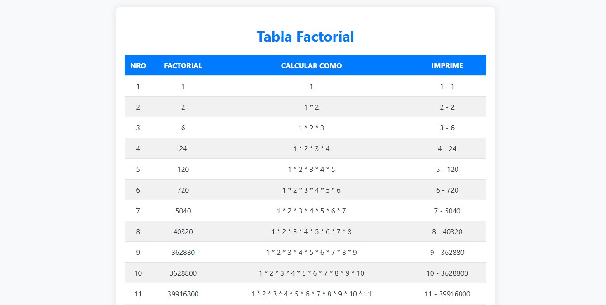

# Generador Dinámico de Factoriales

Esta actividad es una aplicación web simple diseñada para mostrar una tabla factorial utilizando HTML, CSS y PHP. La página web genera dinámicamente una tabla que muestra los números del 1 al 15, sus factoriales correspondientes, la forma de cálculo de cada factorial y una impresión formateada de los resultados.

  

El script PHP inserta filas en la tabla para los números del 1 al 15:

- **Variables Iniciales:** $varmin (inicia en 1), $varmax (máximo 15) y $varfactorial (inicia en 1).

- **Cálculo del Factorial:** El valor de $varfactorial se actualiza multiplicándolo por el valor actual de $varmin.

- **Visualización del Cálculo:** Una cadena que muestra el proceso de cálculo del factorial.

- **Impresión del Resultado:** Imprime el número y su factorial en la tabla.

Esta actividad demuestra habilidades en el uso de tecnologías web front-end y back-end, proporcionando una solución efectiva para la visualización de cálculos matemáticos en una interfaz web.

**Consulta la versión preliminar de la actividad aquí:** [https://ejercicio_01.com](https://www.alejandrovillegas.dev/projects/exercise-01/index.php)

# 📌 Información de la Actividad

Esta actividad ha sido desarrollado como parte del portafolio de soluciones tecnológicas, con el objetivo de ofrecer una herramienta eficiente y funcional para usuarios autodidactas interesados en la gestión y desarrollo de proyectos web.

- **Área**: Desarrollo de Actividades Web

- **Usuario Final**: TecNM

- **Fecha de Desarrollo**: 17 de enero de 2018

- **Portafolio de Proyectos**: [www.alejandrovillegas.dev](https://www.alejandrovillegas.dev)

## 🔧 Guía de Instalación y Configuración de la Actividad

1. Descargue y descomprima el archivo del proyecto en su sistema local.

La actividad ahora está funcionando en su entorno local. 🎉
